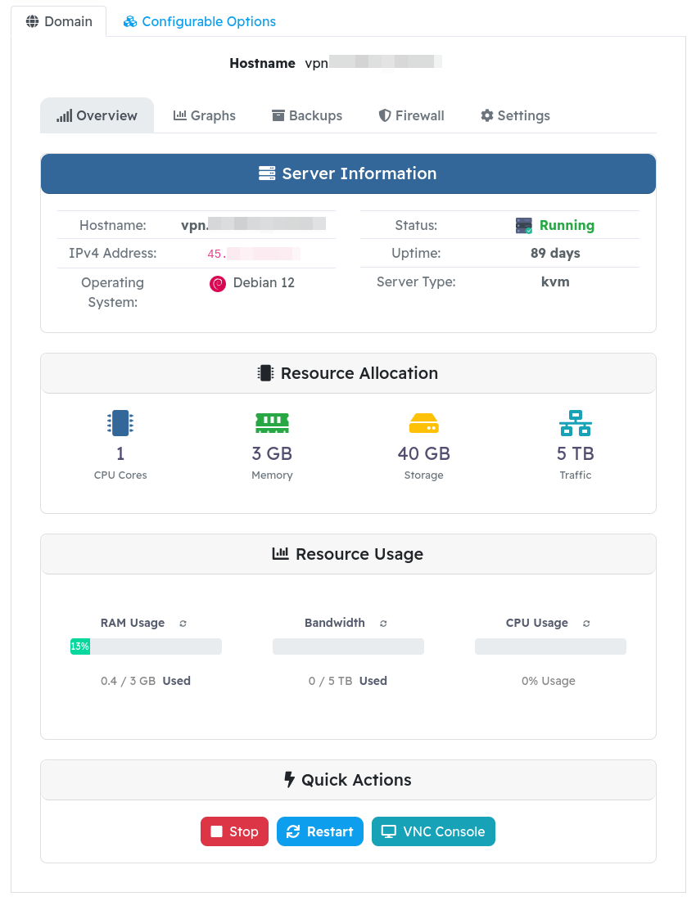
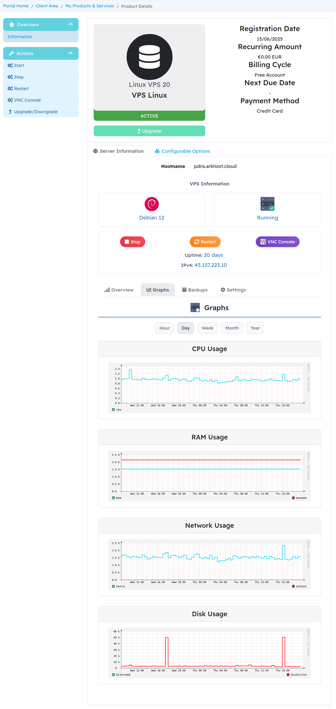
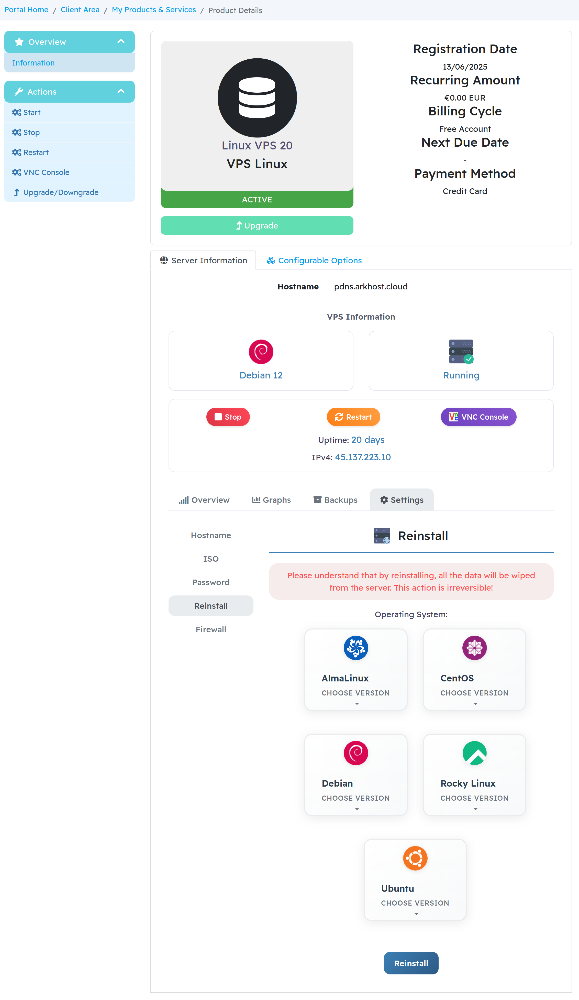

# WHMCS VPS Management Module - ArkHost VPSAG

A WHMCS server module for VPS management with multi-language support.

## Features

- VPS control (start/stop/restart)
- Backup management
- Firewall configuration
- OS reinstallation with advanced options
- Resource monitoring
- VNC console access
- 8 language support
- Responsive design

## Requirements

- WHMCS 8.9+
- PHP 7.4+
- VPSag API access

## Screenshots

### Main Interface

### Analytics Dashboard

### Configuration Panel

## Support Policy

This is free, open-source software provided AS-IS.

**NO SUPPORT** is provided except through paid channels:
- Premium Support: €100/hour (2 hour minimum)
- Email: support@arkhost.com (paid support only)

### Before Requesting Support
- English only
- Must provide complete error logs
- Must provide steps to reproduce
- Vague reports like "doesn't work" will be ignored

### GitHub Issues
- For documented bugs only
- Requires complete technical information
- Issues lacking proper information will be closed immediately
- This is not a support forum

If you need help with basic installation or configuration, purchase premium support.

MIT License
© 2025 ArkHost
