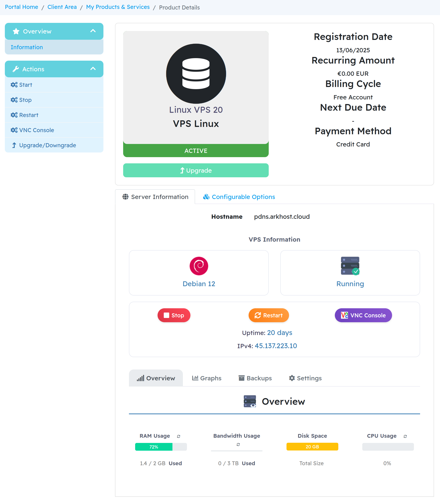

# WHMCS VPS Management Module - ArkHost VPSAG

A WHMCS server module for VPS management with multi-language support.

## Features

- VPS control (start/stop/restart)
- Backup management
- Firewall configuration
- OS reinstallation with advanced options
- Resource monitoring
- VNC console access
- 8 language support
- Responsive design

## Requirements

- WHMCS 8.9+
- PHP 7.4+

## Screenshots

### Main Interface

### Analytics Dashboard

### Configuration Panel

## Changelog

### Version 1.2
- Custom notifications replace browser popups
- Confirmation dialogs for critical actions
- Multi-language support for all notifications
- Smart post-installation script examples based on OS
- Fixed firewall rules not displaying after creation
- Improved UI styling and animations

### Version 1.1
- Basic VPS management
- Backup operations
- Firewall rules
- OS reinstall

### Version 1.0
- Initial release

MIT License
© 2025 ArkHost
